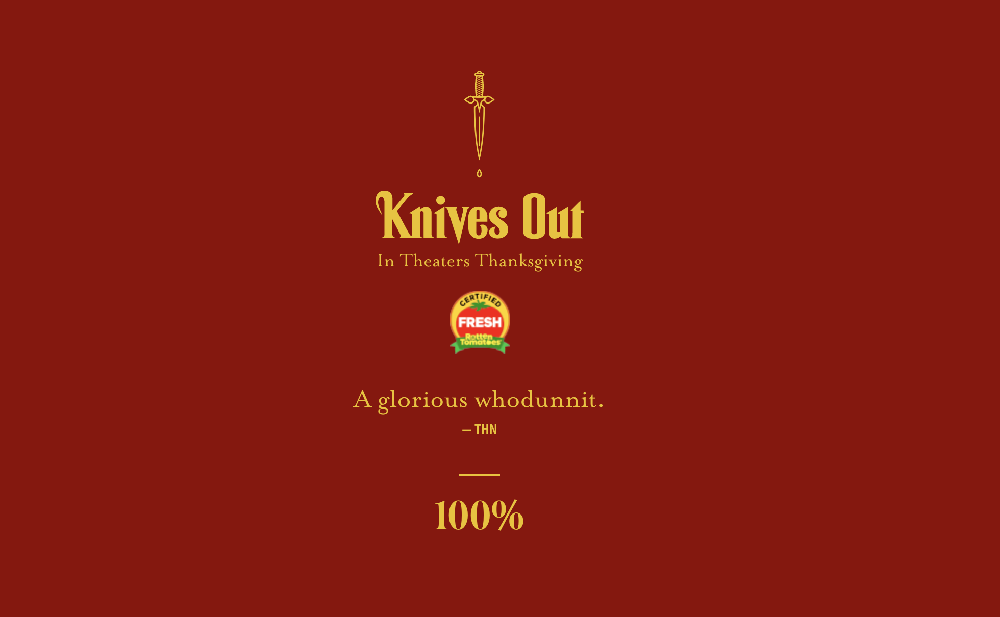

# Joyce's Final Project
 
### Summary

As a web developer, I am interested in developing a commercial portfolio for my all-time favorite sitcom Friends. It would serve both as an advertisement for those who haven’t watched the show and as an interactive site for fans who love the show and want to relive some of the classic plots and scenes. 

### Inspiration

I became interested in this topic almost on the first day of our course when Prof.Qi talked about doing things we feel passionate about. I started watching the show when I was 16 and have watched the 10 seasons more than 10 times. Also, starting from next month towards next January, a Friends pop-up is happening in Boston in celebration of 25 years since the show debuted. So I think this would be a good opportunity for the show to get more exposure online and a commercial portfolio is definitely a good way to do so.

### Design and Technical reference:
There are many great film and TV website examples that I can draw inspiration from, for example:
1. https://knivesout.movie/ This is my favorite one. I really like the loading page as well as the mousemove animation of the background of this website that creates a sense of 3D experience for the viewers.
For the mousemove animation effect, I wonder if I can follow this youtube tutorial: youtube.com/watch?v=Trxxw4tdaHQ

2. https://www.onceuponatimein1969.com/ This is the website for Once Upon a Time in Hollywood. I feel the nostalgic style fits my targeted TV shows "Friends" better. I like the big shaking 1969 at the home page as well as the map of Hollywood created for exploration of celebrities events at that time. 
I'm still in search for more inspirations right now and will put more references here once I do.

### Process:
So far I have searched for film and TV website examples to get inspired. Visually speaking, in my imagination my website would look a lot like OnceUponaTimein1969 in its nostalgic style. It should at least host: a home page, a trailer page(that directs viewers to some of the amazing clips in Friends), a map page (that maps out some important events happened in the show), a gallery (that displays some of the behind-the-scene fottages of the show) and a link to get tickets for the Boston pop-up.  I will also try to borrow some aniamtion effects from the KnivesOut and other websites that I can find later. My next steps would invovle more research on some amazing website examples and try to find contents (e.g. videos & images) to put on my website. During the reserach process, I will try out some animation effects tutorial to see if I can fully understand them and use them on my website. 
