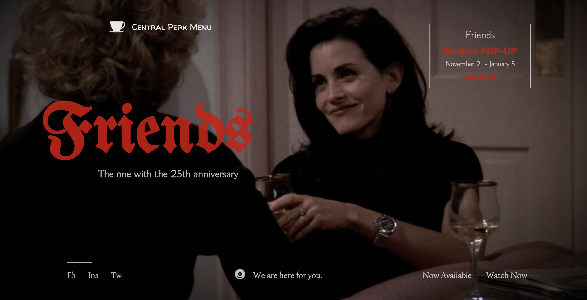

# Joyce's Final Project
 
### Summary

As a web developer, I am interested in developing a commercial portfolio for my all-time favorite sitcom Friends. It would serve both as an advertisement for those who haven’t watched the show and as an interactive site for fans who love the show and want to relive some of the classic plots and scenes. 

### Inspiration

I became interested in this topic almost on the first day of our course when Zhenzhen talked about doing things we feel passionate about. I started watching the show when I was 16 and have watched the 10 seasons more than 10 times. Also, starting from next month towards next January, a Friends pop-up is happening in Boston in celebration of 25 years since the show debuted. So I think this would be a good opportunity for the show to get more exposure online and a commercial portfolio is definitely a good way to do so.

### Design and Technical reference:
I draw inspirations mainly from two film promotion websties.
1. https://www.onceuponatimein1969.com/ This is the website for Once Upon a Time in Hollywood. I feel the nostalgic style fits my targeted TV shows "Friends" better. I like the big shaking 1969 at the home page and the video background.

2. http://ladybird.movie/home/ This one is for Lady Bird. I love the simplicity of the overall design, which makes the message of each page really stand out. The dropdown navigation bar is a good way to save space and create interative experience. 

I borrowed visual design elements from both these two websites. For example, I noticed that there is no overflow for either of them, meaning the size of the website is the same as the size of the screen with no scrolling. I thought this would be a good idea. Given that there are already a lot going on just in this window, it would be distracting or exhausting if there is more after the audience scroll. This is why I did the same to my website, no scrolling. Also, I found that the structure of a film promotion website usually consist of a synopsis page that gives audience a general idea of what the show is about, a credit to cast & crew page, a gallery with photos and trailers and a link to get the tickets. So when I was designing the structure of my website, it was basically the same: a synopsis, a cast&crew, a quote gallery and a link to buy tickets on the home page. Also I've included a little quiz, which was inspired by the website for Lady Bird. I think this could potentially add on to the interactive experience of the audience, especially those who are familiar with the show.

As for the technical aspect, I didn't use any js library. Everything is vanilla js that I learned from youtube tutorials. There is one channel I particularly liked, it's called Dev Ed. He made a lot of amazing videos on responsive navbar, page transition and other animation effect using either js library or vanilla js. His tutorial is very accessible, easy to understand. It has been very helpful to me during my coding process.

### Process:
The design of my final project, as mentioned above, starts with a search for inspirations from current film promotion websites. The two I picked are the one for Once Upon a time in Hollywood and Lady Bird. Based on these two websites, I've decided to structure my website in the following way: a synopsis page, a cast & crew page, a quote gallery and a small quiz. 
##### Home page added:

##### Dropdown navbar added:

##### Synopsis added:

##### Cast & Crew with a content slider added:

##### Quotes gallery added:

##### Each character card is linked with a quotes gallery page:

##### Quiz prototype added:

### Reflection:
Before this final project, especially during our digital resume assignment, the question I usually asked is what kinds of cool animation or transition effects can I use? But as I was designing this website, the question becomes more about why should I use it here and there and how that makes the content more obvious or engaging. So the focus is still more about the content rather than techniques. It is not about having something for the audience to touch on but why and what kinds of response we'd like to provide. Another thought I had is what interactivity means in a promotion website. I think one of the points here is not to give the information to the audience all at once, but letting them having the opportunity to explore and find the information themselves. I think the excitement of discovering something, whether it is a small navigation burger, or a familiar song, can really make the message stick to mind. 
